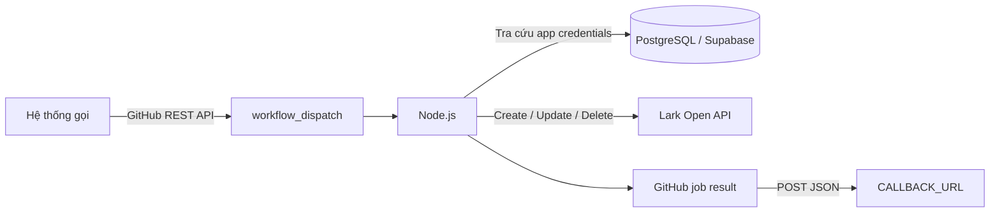

# Node Message Lark

Dịch vụ thực thi tác vụ nhắn tin Lark thông qua GitHub Actions. Hệ thống bên ngoài gọi GitHub REST API để chạy workflow; workflow lấy cấu hình ứng dụng Lark từ PostgreSQL/Supabase, chạy Node.js để gửi, chỉnh sửa hoặc thu hồi tin nhắn, sau đó trả kết quả về `CALLBACK_URL`.

## Chức năng

| Chức năng              | Node.js             | GitHub workflow                | Lark API                                  |
| ---------------------- | ------------------- | ------------------------------ | ----------------------------------------- |
| Gửi tin nhắn trực tiếp | `send_dm.js`        | `send-message-workflow-v2.yml` | Create message, `receive_id_type=open_id` |
| Gửi tin nhắn nhóm      | `send_group.js`     | `send-message-group.yml`       | Create message, `receive_id_type=chat_id` |
| Chỉnh sửa tin nhắn     | `edit_message.js`   | `edit-message-workflow.yml`    | Update message                            |
| Thu hồi tin nhắn       | `recall_message.js` | `recall-message-workflow.yml`  | Delete/recall message                     |

Tin gửi mới và tin chỉnh sửa đều có kiểu `post`. Nội dung hỗ trợ xuống dòng và một số định dạng đơn giản như `**bold**`, `~~bold~~`, `~*bold italic*~`.

## Luồng tổng quát



GitHub API chỉ xác nhận workflow đã được tạo; kết quả nghiệp vụ cuối cùng được gửi bất đồng bộ đến `CALLBACK_URL`. Dùng `request_id` để đối chiếu request ban đầu với callback.

## Bắt đầu nhanh

1. Cấu hình GitHub Environment `environment-production` với:
   - Secret `DATABASE_URL`.
   - Secret `CALLBACK_URL`.
   - Variable `DB_CHAT_NAME` cho luồng gửi nhóm.
2. Bảo đảm Lark app đã bật bot, được cấp quyền phù hợp và có mặt trong cuộc hội thoại cần thao tác.
3. Tạo GitHub token có quyền ghi Actions đối với repository.
4. Gọi endpoint:

```text
POST https://api.github.com/repos/vutiendung23092002/node-message-lark/actions/workflows/{workflow_file}/dispatches
```

Ví dụ gửi tin nhắn trực tiếp:

```bash
curl -L --fail-with-body \
  -X POST \
  -H "Accept: application/vnd.github+json" \
  -H "Authorization: Bearer $GITHUB_TOKEN" \
  -H "X-GitHub-Api-Version: 2026-03-10" \
  https://api.github.com/repos/vutiendung23092002/node-message-lark/actions/workflows/send-message-workflow-v2.yml/dispatches \
  -d '{
    "ref": "main",
    "return_run_details": true,
    "inputs": {
      "request_id": "req-20260813-001",
      "OU_ID": "ou_xxx",
      "TITLE": "Thông báo",
      "MESSAGE_TEXT": "Nội dung tin nhắn"
    }
  }'
```

## Tài liệu chi tiết

- [Kiến trúc và luồng hoạt động](docs/architecture.md)
- [Cấu hình môi trường và cơ sở dữ liệu](docs/configuration.md)
- [Chi tiết các Node và Lark API](docs/message-operations.md)
- [Gọi workflow bằng GitHub REST API](docs/github-actions-api.md)
- [Payload callback](docs/callbacks.md)

## Công nghệ

- Node.js 20 trong GitHub Actions
- `@larksuiteoapi/node-sdk`
- PostgreSQL/Supabase qua `pg`
- GitHub Actions `workflow_dispatch`
