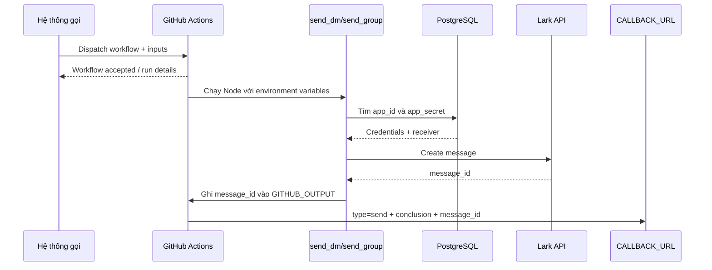
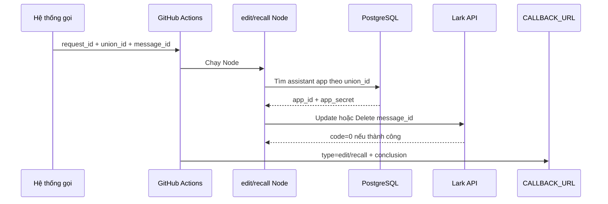

# Kiến trúc và luồng hoạt động

## Thành phần

| Thành phần          | Trách nhiệm                                                 |
| ------------------- | ----------------------------------------------------------- |
| Hệ thống gọi        | Tạo `request_id`, gọi GitHub REST API và nhận callback      |
| GitHub Actions      | Nhận input, thiết lập môi trường, chạy Node và gửi callback |
| Node scripts        | Tra cứu đúng Lark app rồi gọi Lark Open API                 |
| PostgreSQL/Supabase | Lưu quan hệ người dùng/nhóm với Lark app credentials        |
| Lark Open API       | Gửi, chỉnh sửa hoặc thu hồi tin nhắn                        |
| Callback endpoint   | Nhận kết quả cuối của workflow                              |

## Luồng gửi tin nhắn

`send_dm.js` tìm app theo `open_id`. `send_group.js` tìm thông tin nhóm và app trong bảng được cấu hình bởi `DB_CHAT_NAME`.

## Luồng chỉnh sửa hoặc thu hồi

Trong hai luồng này, `union_id` không phải đích của API update/delete. Nó được dùng để xác định tổ chức và app đã gửi tin. Lark thao tác tin nhắn dựa trên `message_id`.

## Job callback

Mỗi workflow có hai job:

1. Job nghiệp vụ gọi Lark.
2. `callback-job` có `if: always()` nên vẫn chạy khi job nghiệp vụ thành công, thất bại hoặc bị hủy.

Trường `conclusion` trong callback lấy từ kết quả job nghiệp vụ. Với luồng gửi, `message_id` được chuyển từ Node sang step bằng `$GITHUB_OUTPUT`, rồi từ job nghiệp vụ sang callback bằng job output. Nếu gửi thất bại trước khi Lark trả ID, callback có `message_id` rỗng.

## Tính bất đồng bộ

Request dispatch GitHub không chờ Lark xử lý xong. Không dùng HTTP response của endpoint dispatch làm kết quả gửi tin. Quy trình đúng là:

1. Sinh một `request_id` duy nhất.
2. Dispatch workflow.
3. Lưu trạng thái `pending` ở hệ thống gọi.
4. Khi nhận callback có cùng `request_id`, cập nhật thành `success`, `failure` hoặc `cancelled`.

## Ràng buộc Lark quan trọng

- Bot chỉ chỉnh sửa hoặc thu hồi tin nhắn mà đúng app đó đã gửi, trừ trường hợp có quyền quản trị nhóm phù hợp.
- Edit thay thế toàn bộ nội dung rich-text, vì vậy workflow edit bắt buộc truyền lại `title`.
- Tin nhắn có giới hạn số lần/thời gian chỉnh sửa và thời hạn thu hồi theo cấu hình tenant.
- Bot phải có quyền cần thiết và vẫn thuộc cuộc hội thoại liên quan.

Tham khảo [Lark Create message](https://open.larksuite.com/document/server-docs/im-v1/message/create), [Update message](https://open.larksuite.com/document/server-docs/im-v1/message/update) và [Delete message](https://open.larksuite.com/document/server-docs/im-v1/message/delete).
